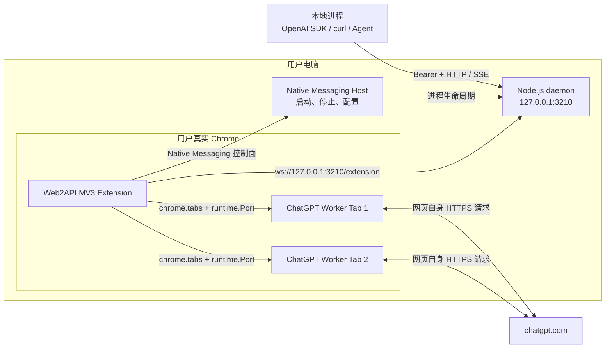
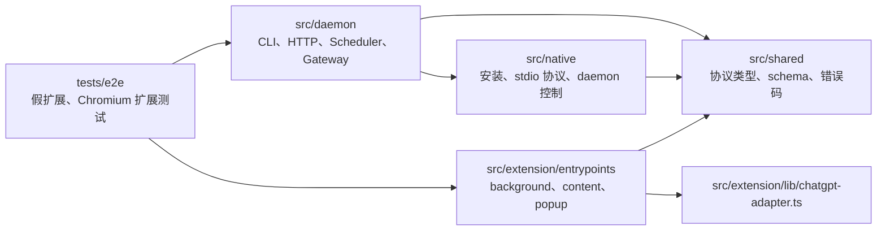
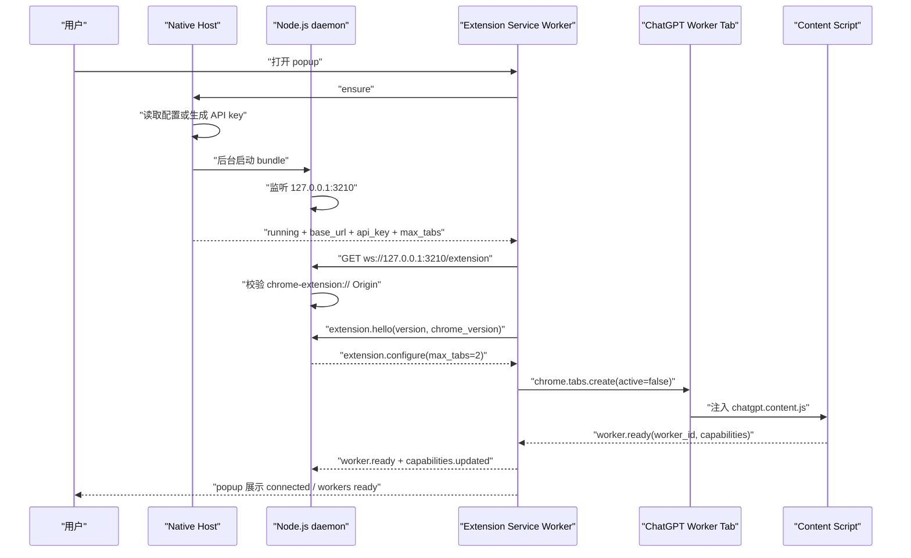
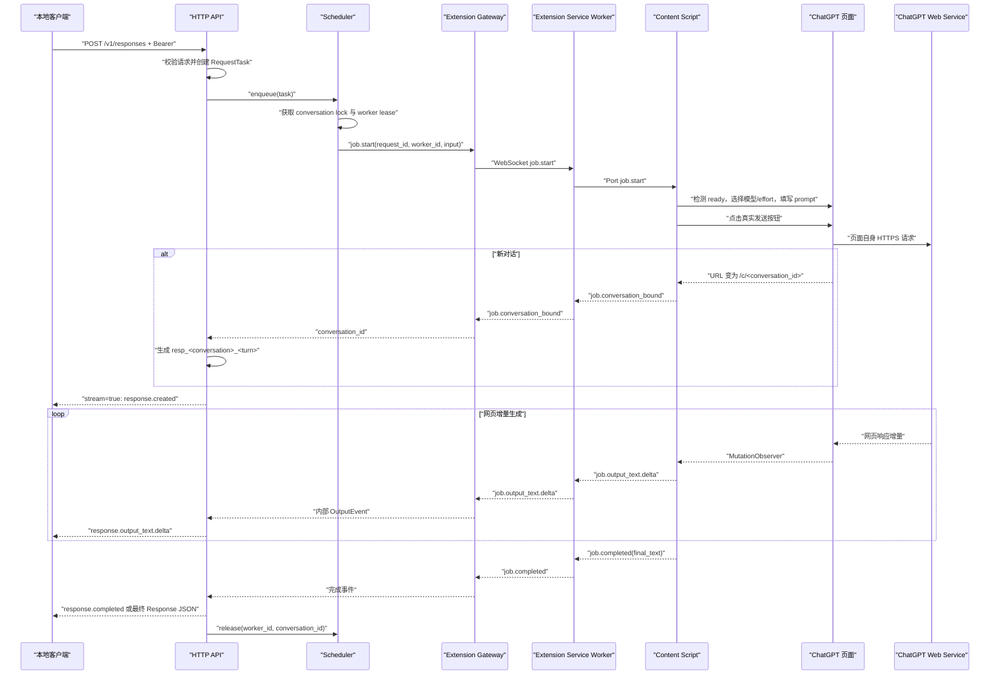
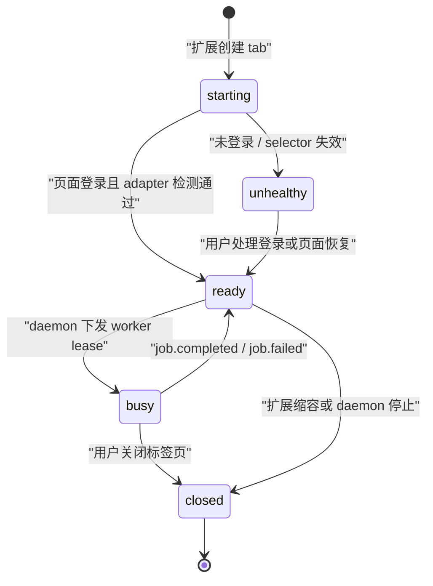
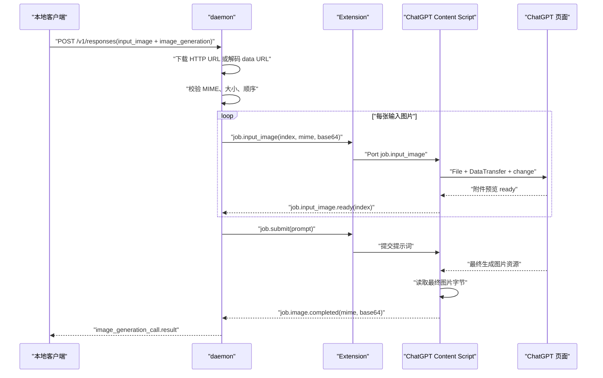

# web2api v001 技术设计

## 1. 技术决策

### 1.1 已确认边界

- 第一期只支持 ChatGPT
- 对本地进程提供 OpenAI Responses API 兼容 HTTP API
- 复用用户在 Chrome 中已有的 ChatGPT 登录会话
- 优先目标是易安装、易使用和客户端兼容性
- 第一期不把 ChatGPT 私有接口稳定性视为可承诺契约
- 第一期支持文本响应和图片生成
- 第一期图片能力包含外部图片输入与基础编辑

### 1.2 已确认决策

#### D001 daemon 运行与交付形态

状态：已确认

候选方案：

1. Node.js + TypeScript 本地服务，通过 npm/npx 启动
2. Go 单文件 daemon，由安装器注册为用户级后台服务
3. Chrome 扩展通过 Native Messaging 按需拉起本地进程

推荐方案：Node.js + TypeScript daemon，由一次性 npm 命令安装 Native Messaging Host，日常生命周期由扩展 popup 管理

理由：第一批用户本机需要 Node.js，但不应要求每次使用时手工打开终端并保持进程前台运行。popup 给出包含自身 Extension ID 的一次性命令：`npx -y glidea-web2api@latest install --extension-id <id>`。命令把已打包的 daemon 运行时和启动脚本复制到稳定目录，并注册 Chrome Native Messaging Host。此后扩展可以启动、停止、重启和配置 daemon。

这里不安装系统服务，不要求管理员权限，也不需要 macOS 开发者签名、Windows 代码签名或桌面商店审核。代价是机器必须保留 Node.js，而且 Node 可执行文件的绝对路径在安装时固定；Node 被版本管理器删除或迁移后，用户需要重新执行安装命令。无 Node 用户的单文件分发继续作为后续方案，不阻塞第一期。

结论：第一期使用 Node.js + TypeScript daemon。一次性 npm 命令负责本地注册，popup 负责日常控制；`glidea-web2api start` 仅作为手工回退路径。不使用 Go，不安装系统后台服务。

### 1.3 已确认决策

#### D002 daemon 与 Chrome 扩展通信机制

状态：已确认

候选方案：

1. 所有通信只走本地 WebSocket
2. 所有通信只走 Native Messaging
3. Native Messaging 控制面 + HTTP/WebSocket 数据面

推荐方案：Native Messaging 控制面 + HTTP/WebSocket 数据面

理由：Native Messaging 是 Chrome 官方提供的扩展到本机进程机制，适合低频、小消息的启动、停止、状态查询和配置，但它使用 stdio 帧协议，不适合作为 OpenAI 客户端可直接访问的 HTTP API，也不适合承载图片和流式响应。daemon 启动后，扩展主动连接 `ws://127.0.0.1:<port>/extension`，继续用同一连接收发任务和流式事件。本地客户端始终访问 loopback HTTP。

结论：Native Messaging 只负责 daemon 生命周期和配置；Responses API 走 HTTP，daemon 与扩展的任务数据走 WebSocket。控制面故障不会改变数据协议，手工启动 daemon 时扩展仍可通过 WebSocket 连接。

### 1.4 已确认决策

#### D003 ChatGPT 执行方式

状态：已确认

候选方案：

1. Content Script 操作 ChatGPT 页面 DOM
2. 在页面上下文中调用 ChatGPT 私有网络接口
3. DOM 与私有网络接口同时实现并自动切换

推荐方案：Content Script 操作 ChatGPT 页面 DOM

理由：第一期只需要文本对话和流式输出。DOM 方案复用网页自身的登录、风控、模型选择和请求逻辑，不需要复制 ChatGPT 私有协议。它的主要代价是页面结构变化时需要更新选择器，但故障边界清楚。双实现会增加状态同步和测试成本，不符合第一期目标。

结论：第一期使用 Content Script 操作 ChatGPT 页面 DOM。

### 1.5 已确认决策

#### D004 本地 API 兼容范围

状态：已确认

候选方案：

1. 只实现 `POST /v1/responses`
2. 同时实现 `POST /v1/responses` 和 `POST /v1/chat/completions`

推荐方案：只实现 `POST /v1/responses`

理由：Responses API 原生表达文本、多轮状态和 `image_generation` 工具，适合作为第一期唯一契约。同时维护两套请求、响应和 SSE 事件格式会扩大实现与测试范围。高兼容性应先保证已声明接口行为正确，而不是同时提供两个不完整接口。

原结论废止：不再以 Chat Completions 作为第一期主接口。

图片生成契约：请求通过 `tools: [{"type": "image_generation"}]` 声明能力，最终图片以 `image_generation_call.result` base64 返回。ChatGPT 网页没有公开 partial image 事件，因此第一期不承诺 `response.image_generation_call.partial_image`。

结论：第一期只实现 `POST /v1/responses` 这一种生成接口，支持文本响应与最终图片生成结果；`GET /v1/models` 和 `/healthz` 仅作为发现与诊断端点。

### 1.6 已确认决策

#### D005 Responses 对话状态恢复

状态：已确认

候选方案：

1. 在 `response.id` 中编码 ChatGPT conversation ID
2. daemon 将 `response.id -> conversation_id` 持久化到本地数据库
3. daemon 只在内存保存 `response.id -> conversation_id`

推荐方案：在 `response.id` 中编码 ChatGPT conversation ID

理由：客户端通过 `previous_response_id` 续接对话。daemon 可以从该 ID 直接恢复 ChatGPT conversation URL，不需要数据库，也不会因为 daemon 重启丢失映射。`response.id` 对客户端本来就是不透明字符串，格式使用 `resp_<conversation_id>_<turn_id>`；没有 `previous_response_id` 时创建新 ChatGPT 对话。

结论：`response.id` 编码 ChatGPT conversation ID，不保存独立会话映射。

### 1.7 已确认决策

#### D006 并发请求处理

状态：已确认

候选方案：

1. 可配置固定标签页池，默认 `max_tabs = 1`
2. 可配置固定标签页池，默认 `max_tabs = 2`
3. 可配置固定标签页池，默认 `max_tabs = 4`

推荐方案：可配置固定标签页池，默认 `max_tabs = 2`

理由：daemon 维护 FIFO 请求队列和固定 worker 集合，每个 worker 对应一个专用 ChatGPT 标签页，同一标签页同一时间只执行一个请求。标签页按需创建并复用，不为每个请求创建新标签页。`max_tabs` 是唯一的并发配置源。默认值 2 可以覆盖常见客户端的少量并发，又不会默认打开过多页面；用户可以设为 1 获得最稳定的串行行为。

结论：使用可配置固定标签页池，默认 `max_tabs = 2`。

### 1.8 已确认决策

#### D007 本地 API 认证

状态：已确认

候选方案：

1. daemon 首次启动自动生成 API token，所有 API 请求必须使用 Bearer token
2. 只绑定 loopback，不校验 API token
3. 用户安装时手动设置 API token

推荐方案：daemon 首次启动自动生成 API token，所有 API 请求必须使用 Bearer token

理由：OpenAI SDK 本身使用 `Authorization: Bearer <token>`，因此不会增加协议适配。自动生成避免用户设计凭据，popup 可以展示 `base_url` 和 token。daemon 只监听 loopback；安装命令把 Extension ID 写入配置，WebSocket 只接受该固定 Origin。API token 只进入 Extension Service Worker 和 popup，不下发给 Content Script。

结论：daemon 自动生成并持久化 API token，所有本地 API 请求必须通过 Bearer token 认证。

### 1.9 已确认决策

#### D008 模型选择语义

状态：已确认

候选方案：

1. 提供 `chatgpt/default`，并动态暴露当前账号页面可选择的 `chatgpt/<model>`
2. 只提供 `chatgpt/default`
3. 接受任意 `model` 值但忽略它

推荐方案：提供 `chatgpt/default`，并支持通过 `chatgpt/<model>` 操作页面模型选择器

理由：`chatgpt/default` 不操作模型选择器，直接使用页面当前默认值，是稳定兜底。扩展同时扫描当前账号实际可见的模型选项并上报 daemon，`GET /v1/models` 返回 `chatgpt/default` 和这些动态模型。请求显式模型时，扩展在提交提示词前切换页面模型。模型名称、可用性和 DOM 都是不稳定契约，但这是完整产品能力，不能用固定模型表假装稳定。

模型和思考等级保持独立：`model` 只选择模型；思考等级使用 Responses API 原生的 `reasoning.effort`，不编码进模型 ID。请求的模型当前不可用时返回明确错误，不回退到默认模型。

结论：默认模型 ID 为 `chatgpt/default`；支持动态发现和切换 `chatgpt/<model>`；`reasoning.effort` 单独控制思考等级。

### 1.10 已确认决策

#### D009 图片生成范围

状态：已确认

候选方案：

1. 支持文本生图、续接修改，以及 URL 和 base64 data URL 形式的外部 `input_image`
2. 在方案 1 基础上实现 `/v1/files`，额外支持 `file_id`
3. 只支持 base64 data URL 形式的外部 `input_image`

推荐方案：支持 URL 和 base64 data URL 形式的外部 `input_image`，第一期不支持 `file_id`

理由：没有外部图片输入就无法完成基础图片编辑，这个能力不能删。Responses API 的 `input_image` 支持完整 URL、base64 data URL 和 Files API 的 `file_id`。前两种可以由 daemon 直接取得图片字节，再交给扩展通过 ChatGPT 页面附件控件上传；`file_id` 则依赖额外的 `/v1/files`、文件持久化和生命周期管理，不属于同一个最小闭环。第一期明确拒绝 `file_id`，不静默忽略。

计划链路：daemon 下载 URL 或解码 data URL，将图片字节通过本地 WebSocket 发送给扩展；Content Script 将字节构造成 `File`，通过 ChatGPT 页面真实附件控件上传，再提交编辑提示词。一个请求中的多个 `input_image` 按原顺序上传。

结论：第一期支持 URL 和 base64 data URL 形式的单图或多图 `input_image`，支持新建编辑与通过 `previous_response_id` 续接编辑；第一期不实现 `/v1/files`，不接受 `file_id`。

### 1.11 已确认决策

#### D010 思考等级映射失败策略

状态：已确认

候选方案：

1. 严格映射，只有当前页面适配器明确支持的 `reasoning.effort` 才执行，否则返回错误
2. 将不支持的 effort 自动映射到最接近的页面等级
3. 接受但忽略 `reasoning.effort`

推荐方案：严格映射

理由：Responses API 当前允许 `none`、`minimal`、`low`、`medium`、`high`、`xhigh` 和 `max`，但 ChatGPT 页面不会保证提供一一对应的选项。适配器应显式声明当前页面选项与标准 effort 的映射；请求省略 effort 时使用页面默认值，无法映射时返回明确错误。自动降级或忽略参数都会让调用方误判实际执行强度。

结论：省略 `reasoning.effort` 时使用页面默认等级；提供 effort 时只执行适配器中明确存在的映射；无法映射时返回 `400`，不自动降级，不静默忽略。

### 1.12 已确认决策

#### D011 流式与非流式响应

状态：已确认

候选方案：

1. 同时支持 `stream: true` 和 `stream: false`，共用一条内部事件流
2. 第一期只支持非流式最终响应
3. 第一期只支持流式 SSE

推荐方案：同时支持流式与非流式，共用内部事件流

理由：Content Script 通过 `MutationObserver` 增量读取当前 assistant 消息，并向 daemon 上报统一的文本增量、图片结果、完成和错误事件。`stream: true` 时 daemon 将这些事件转换为 Responses API 的 typed SSE；`stream: false` 时聚合相同事件并返回最终 Response JSON。这样兼容两类客户端，同时不维护两套浏览器执行逻辑。

流式文本至少发送完整的标准生命周期事件，包括 `response.created`、output item/content part 创建、`response.output_text.delta`、对应的 done 事件和 `response.completed`。图片第一期只在网页生成完成后发送最终 `image_generation_call`，不伪造 partial image 事件。

结论：第一期同时支持 `stream: true` 和 `stream: false`；浏览器执行统一产生内部事件，daemon 分别转换为 typed SSE 或最终 Response JSON。

### 1.13 已确认决策

#### D012 同一对话的并发请求

状态：已确认

候选方案：

1. 按 ChatGPT conversation ID 串行，同一对话后续请求排队，不同对话可并行
2. 同一对话已有请求执行时，新请求立即返回 `409`
3. 允许同一对话在多个标签页并发执行

推荐方案：按 conversation ID 串行

理由：两个请求如果同时携带同一个 `previous_response_id`，并被分配到不同标签页，它们会从同一历史节点同时续写，最终产生网页分支或覆盖关系不明确。daemon 应在调度层为 conversation ID 加互斥占用；同一对话的后续请求进入 FIFO 队列，不同对话仍可使用多个标签页并行执行。

示例：A1 和 A2 属于对话 A，B1 属于对话 B。`max_tabs = 2` 时先并行执行 A1、B1；A2 等待 A1 完成后再运行，不需要等待 B1。

结论：daemon 按 conversation ID 串行调度同一对话，不同对话可以使用标签页池并行执行。

### 1.14 已确认决策

#### D013 工程技术栈

状态：已确认

结论：

- 工作区与发布：pnpm workspace 开发，daemon 发布为 npm CLI 包
- daemon：Node.js 22+、TypeScript、`node:http`、`ws`、Zod
- Chrome 扩展：沿用 OPCStack 的 WXT + Manifest V3 + TypeScript + Svelte
- Content Script：原生 DOM API，不引入页面自动化框架
- 共享契约：daemon 和扩展直接引用同一份 TypeScript 类型与 Zod schema
- 测试：Vitest 负责单元与协议测试，Playwright Chromium 负责加载真实 MV3 扩展的 E2E
- 持久化：JSON 配置文件，不引入数据库

选择 Node 原生 HTTP 而不是 Express、NestJS 或 Fastify，是因为第一期只有三个 HTTP 端点和一个 WebSocket 路径。框架不会减少核心复杂度，只会增加中间层。Svelte 只用于 popup 和 options，不能进入 Content Script 的 DOM adapter。

## 2. 目标与边界

### 2.1 目标

- 本地进程只需要修改 OpenAI SDK 的 `base_url` 和 API key 即可调用
- 复用用户真实 Chrome 中的 ChatGPT 登录状态，不复制 Cookie，不读取浏览器凭据
- 支持文本、流式输出、多轮续接、模型切换、思考等级、文本生图和外部图片编辑
- Chrome 页面变化时只修改扩展中的 ChatGPT adapter
- daemon 重启后仍可通过 `previous_response_id` 续接已有 ChatGPT 对话

### 2.2 非目标

- 不调用或复刻 ChatGPT 私有网络 API
- 不实现 Chat Completions API、Files API、Assistants API 和 Batch API
- 不支持函数调用、Web Search、File Search、Computer Use 等其他 Responses tools
- 不提供账号共享、远程访问、配额绕过或风控绕过
- 不保证与 OpenAI 官方 Responses API 完全等价，只保证本文声明的兼容子集
- 不缓存提示词、响应或生成图片

### 2.3 运行前提

- 机器已安装 Node.js 22 或更高版本；无 Node 分发不属于第一期
- Chrome 必须运行，版本不低于 116
- Chrome 扩展已安装并连接 daemon
- 用户已在真实 `chatgpt.com` 页面登录
- 至少一个专用 ChatGPT 标签页处于 ready 状态
- ChatGPT 当前账号具备请求所需的模型、思考等级、图片上传或生图能力

### 2.4 合规边界

该方案存在明确的平台条款风险。OpenAI 面向个人用户的 Terms of Use 禁止自动或程序化提取数据或 Output，也禁止绕过速率限制和保护措施。web2api 不应被描述为官方支持的接入方式，也不应实现验证码、速率限制、账号限制或安全措施的绕过逻辑。发布前必须单独做条款审查和账号风险评估。

## 3. 系统架构

### 3.1 部署视图



用户只接触两个产物：Chrome 扩展和 npm 包。npm 安装命令在用户目录复制一个 daemon bundle、一个 Native Host 启动脚本并写入 Chrome Native Messaging manifest。Native Host 是控制入口，daemon 是本地 API 入口，扩展是浏览器执行代理。三者都不持有 ChatGPT Cookie；Cookie 只留在 Chrome 的真实页面中。

Native Host 不承载业务请求。daemon 无法主动找到某个 Chrome 扩展，因此仍由 Extension Service Worker 主动连接固定地址 `ws://127.0.0.1:3210/extension`。本地客户端只连接 daemon，不直接连接扩展或 Native Host。

每个 worker 都是一个真实的 `chatgpt.com` 标签页。标签页可以在后台，但不是 iframe、伪 DOM 或 headless 页面。用户会在 Chrome 标签栏看到它们。

### 3.2 运行时组件视图

```mermaid
flowchart TB
    subgraph Daemon["Node.js daemon"]
        HTTP["HTTP API<br/>认证、解析、连接生命周期"]
        Translator["Responses Translator<br/>请求校验与内部任务构造"]
        Scheduler["Scheduler<br/>FIFO、conversation lock、worker lease"]
        Gateway["Extension Gateway<br/>WebSocket、心跳、消息路由"]
        Projector["Response Projector<br/>内部事件 -> SSE / JSON"]
        Images["Image Resolver<br/>URL 下载 / data URL 解码"]
        Config["Config<br/>port、token、max_tabs"]
    end

    subgraph Bootstrap["Native Bootstrap"]
        Native["Native Host<br/>stdio framing"]
        Controller["Daemon Controller<br/>ensure、status、stop、configure"]
        Native --> Controller
    end

    subgraph Extension["WXT Chrome Extension"]
        SW["Service Worker<br/>连接 daemon、维护 tab_id"]
        Pool["Worker Pool<br/>创建、导航、回收专用 tab"]
        CS1["Content Script 1"]
        CS2["Content Script 2"]
        Adapter["ChatGPT Adapter<br/>所有不稳定 DOM 知识"]
        Popup["Popup<br/>状态与诊断"]
    end

    HTTP --> Translator
    Translator --> Scheduler
    Translator --> Images
    Scheduler --> Gateway
    Gateway --> Projector
    Projector --> HTTP
    Config --> HTTP
    Config --> Scheduler
    Gateway <-->|"typed WebSocket messages"| SW
    SW --> Pool
    Pool --> CS1
    Pool --> CS2
    CS1 --> Adapter
    CS2 --> Adapter
    Popup --> SW
    Popup --> Native
    Controller --> Config
```



请求只沿一个方向流动：`HTTP API -> Translator -> Scheduler -> Gateway -> Service Worker -> Content Script -> ChatGPT Adapter`。输出事件沿原路反向返回。禁止 Content Script 直接知道 Responses API，也禁止 HTTP API 直接知道 CSS selector。

### 3.3 组件职责

| 组件 | 职责 | 不负责 |
| --- | --- | --- |
| CLI Installer | 复制 bundle、写 Native Host manifest、卸载注册 | 安装系统服务或修改 Chrome 登录状态 |
| Native Host | 接收 popup 控制命令，启动、停止和配置 daemon | 承载 Responses 请求和流式数据 |
| CLI | 手工启动服务、打印连接信息、读取配置 | 接管 Chrome 或保存对话 |
| HTTP API | Bearer 认证、请求解析、HTTP/SSE 连接生命周期 | 页面控制和任务调度 |
| Responses Translator | 校验兼容子集，生成 `RequestTask` | 猜测或静默忽略参数 |
| Scheduler | FIFO、conversation lock、worker lease | 创建 Chrome tab |
| Extension Gateway | 单条 WebSocket、心跳、typed message 路由 | 决定任务先后顺序 |
| Image Resolver | 下载 HTTP(S) 图片或解码 data URL | Files API、长期存储 |
| Response Projector | 将内部事件投影为 SSE 或最终 JSON | 重新执行请求 |
| Extension Service Worker | 连接 daemon、管理 tab ID、路由 Port 消息 | 保存请求权威状态 |
| Worker Pool | 按 `max_tabs` 创建、复用、关闭专用标签页 | 解析 Responses 请求 |
| Content Script | 在指定标签页执行一个任务并回传事件 | 跨标签页调度 |
| ChatGPT Adapter | 页面检测、模型选择、上传、提交、增量读取 | daemon 协议和 API 兼容转换 |
| Popup | 安装引导、daemon 控制、API key 与并发标签页设置 | 承担任务执行 |

### 3.4 单一状态源

- 请求状态、队列顺序、conversation lock 和 worker lease 以 daemon 为准
- Chrome tab ID 和 Content Script Port 以扩展 Service Worker 为准
- 当前页面 DOM、可见模型和可见思考等级以 ChatGPT Adapter 的实时扫描为准
- API token 和 `max_tabs` 以 daemon 配置文件为准
- 不在 daemon 与扩展中各保存一份可独立修改的任务状态

`worker_id` 是 daemon 与扩展之间的稳定标识，`tab_id` 只存在于扩展内部。daemon 永远不根据 Chrome tab ID 调度，扩展也不能自行把空闲 worker 分配给请求。

### 3.5 模块与依赖方向



建议目录：

```text
src/
  shared/
    protocol.ts          # daemon <-> extension message schema
    native-protocol.ts   # extension <-> Native Host control schema
    responses.ts         # supported Responses request/response schema
  native/
    installer.ts         # copy runtime and register Native Host
    messaging.ts         # Chrome stdio framing
    controller.ts        # daemon lifecycle commands
  daemon/
    cli.ts               # start/status/config commands
    server.ts            # node:http routes and connection lifecycle
    scheduler.ts         # queue, conversation lock, worker lease
    extension-gateway.ts # WebSocket connection and message routing
    response-projector.ts
    image-resolver.ts
  extension/
    wxt.config.ts
    entrypoints/
      background.ts
      chatgpt.content.ts
      popup/
    lib/
      worker-pool.ts
      chatgpt-adapter.ts
tests/
  e2e/
```

依赖规则只有三条：`shared` 不依赖任何业务模块；daemon 不依赖 WXT；扩展不能导入 daemon。ChatGPT selector 和页面文案只能出现在 `chatgpt-adapter.ts`。

### 3.6 技术栈与交付

- daemon：Node.js 22+ + TypeScript，HTTP 使用 `node:http`，WebSocket 使用 `ws`
- Chrome 扩展：参考 OPCStack，使用 WXT + Manifest V3 + TypeScript + Svelte
- Content Script：运行在 isolated world，通过 `chrome.runtime.Port` 与 Service Worker 长连接
- 请求校验：共享 Zod schema，只在 HTTP 和 WebSocket 边界执行
- 持久化：普通 JSON 配置文件，不引入数据库
- 开发与发布：pnpm 管理工作区，npm 发布 CLI 包，WXT 构建扩展 zip

首次安装使用 popup 生成的 `npx -y glidea-web2api@latest install --extension-id <id>`。固定默认端口为 `3210`，端口被占用时直接报错，不自动漂移，否则扩展和客户端无法可靠发现服务。API key 通过 Native Messaging 只返回给扩展 Service Worker，再由 popup 展示；不能下发给 Content Script。

### 3.7 生命周期边界

- daemon 可以在 Chrome 未运行时手工启动，`/healthz` 此时返回 `extension_connected: false`
- 扩展启动时先通过 Native Host 执行 `ensure`，再连接固定 WebSocket 地址
- Native Host 缺失时 popup 展示一次性安装命令；手工 daemon 已运行时扩展仍可回退连接 WebSocket
- Extension Service Worker 被 Chrome 回收后，下一次事件唤醒时重建 WebSocket 和 Content Script Port
- daemon 退出时所有 queued 和 in-flight 任务失败，不持久化、不重放
- worker tab 关闭只影响绑定它的 worker；busy worker 的任务立即失败
- Content Script 每次页面导航都会重建，Service Worker 根据 `worker_id` 重新绑定 Port

## 4. 核心流程

### 4.1 安装与首次运行

第一期的最短用户路径：

```text
1. 从 Chrome Web Store 安装扩展
2. 打开 popup，复制并运行一次性安装命令
3. 回到 popup 点击 Check again
4. 确认 Connected / Logged in / 2 workers ready
5. 从 popup 复制 Base URL 和 API key 给本地客户端
6. 调用 POST /v1/responses
```

安装命令执行以下确定动作：

```text
1. 把 glidea-web2api.cjs 复制到 ~/.web2api/runtime/
2. 写入 ~/.web2api/bin/glidea-web2api-host
3. 写入 Chrome NativeMessagingHosts/dev.glidea.web2api.json
4. manifest 只允许发起安装的 Extension ID 连接
```

popup 首次调用 `ensure` 时，Native Host 创建 `~/.web2api/config.json`，生成 `wb2_` 前缀 API key，后台启动 daemon 并等待 `127.0.0.1:3210` 可用。npm 安装不能替用户静默安装 Chrome 扩展，这两个安装动作必须明确分开。

### 4.2 daemon 与扩展启动握手



扩展每 20 秒发送一次 heartbeat。daemon 在两个 heartbeat 周期内没有收到消息，就关闭旧连接并失败所有 in-flight 任务。扩展断线期间 daemon 仍提供 `/healthz`，但新的 `/v1/responses` 立即返回 `503 extension_unavailable`，不能无限排队。

扩展重连后重新上报全部 worker 和 capabilities。旧 lease 已失效，不能恢复或重放旧任务。

### 4.3 文本请求完整链路



具体例子：

```http
POST /v1/responses HTTP/1.1
Host: 127.0.0.1:3210
Authorization: Bearer wb2_xxx
Content-Type: application/json

{"model":"chatgpt/default","input":"解释 epoll 的边沿触发","stream":true}
```

daemon 不把这段请求改写成 ChatGPT 私有 API。它只生成内部 `RequestTask`，通过 WebSocket 告诉扩展“在 worker-1 的真实页面中提交这段输入”。ChatGPT 页面自己完成认证、风控和网络请求。Content Script 只读取页面产生的 DOM 结果。

新对话提交后才出现 ChatGPT conversation ID。Content Script 必须先观察 URL 绑定完成，daemon 才能构造 `response.id` 并发送 `response.created`。如果文本先出现，Content Script 在内存中暂存 delta，收到 conversation ID 后按原顺序补发。这个缓冲只影响新对话的首个事件，不增加服务端缓存，也不持久化内容。

### 4.4 worker 标签页生命周期



只有 daemon 可以分配 worker lease，只有扩展可以操作 tab ID。Service Worker 保存 `worker_id -> tab_id -> Port` 映射。Content Script 导航后重新连接时必须携带 `worker_id`，Service Worker 原地替换 Port，不能新建第二个逻辑 worker。

一个 worker 同时只执行一个请求。任务结束后不清空 ChatGPT 会话，而是在下一次任务开始时根据 `previous_response_id` 导航到目标会话，或导航到新对话页。

### 4.5 多轮续接

请求包含：

```json
{
  "model": "chatgpt/default",
  "previous_response_id": "resp_<conversation_id>_<turn_id>",
  "input": "继续解释"
}
```

daemon 从 `previous_response_id` 解析 conversation ID，获取该 conversation lock，然后让 worker 导航到对应的 ChatGPT conversation URL。页面 ready 后再提交新输入。

第一期只保证从该对话当前末尾继续，不保证从任意历史 turn 精确创建分支。`turn_id` 用于生成唯一响应 ID，不用于网页分支定位。

### 4.6 同一对话并发

```text
队列: A1, A2, B1
worker-1: A1 -> A2
worker-2: B1
```

Scheduler 以 conversation ID 为互斥键。A1 执行时 A2 保留在队列中，B1 可以被另一个 worker 获取。新对话在获得 conversation ID 后才建立正式锁；提交前使用 request ID 防止同一任务被重复分配。

### 4.7 外部图片编辑与生图



图片解析必须在任务入队前完成，避免 worker 被租用后等待外部 URL。多图按照 input 顺序逐张上传，每张收到页面预览 ready 后才处理下一张。任何一张失败都在点击发送前终止整个请求。

Chrome 扩展消息使用 JSON 序列化且单条消息上限为 64 MiB，因此每张图片编码后必须低于该上限。图片之间分开发送，单张图片超过上限直接返回错误，不切片传输。

### 4.8 模型与思考等级

```json
{
  "model": "chatgpt/gpt-5-thinking",
  "reasoning": {
    "effort": "high"
  }
}
```

执行顺序固定：

1. 扫描当前页面可用模型与 effort
2. 选择请求模型
3. 选择 `reasoning.effort`
4. 再上传附件和提交 prompt

`chatgpt/default` 跳过模型切换。省略 `reasoning.effort` 跳过思考等级切换。任何显式值无法匹配时，请求在提交前失败，页面不得发送 prompt。

### 4.9 流式提取

ChatGPT Adapter 只观察当前任务对应的 assistant message container：

1. `MutationObserver` 收到变化
2. 读取该容器的规范化纯文本
3. 当前文本以已发送文本为前缀时，只发送新增后缀
4. DOM 暂时缩短时等待下一次 mutation，不发送回滚事件
5. DOM 内容发生非前缀改写且无法恢复时，流式请求失败，不能继续发送可能损坏的 delta
6. 页面停止按钮消失且内容稳定后，读取最终文本或最终图片并发送 completed

非流式请求同样走这条内部事件流，只在 daemon 内聚合。没有第二套页面读取实现。

### 4.10 客户端断开

HTTP 客户端在任务完成前断开时，daemon 向扩展发送 `job.cancel`。Content Script 点击 ChatGPT 页面停止按钮，随后释放 worker 和 conversation lock。第一期不提供后台继续执行和结果找回能力。

### 4.11 连接中断与恢复

| 中断点 | 处理 |
| --- | --- |
| 请求还在 daemon 队列中 | 删除任务，客户端收到错误或连接已关闭 |
| `job.start` 已发送但尚未点击发送 | 取消页面准备，释放 worker |
| prompt 已点击发送 | 尝试点击停止，任务失败，禁止自动重试 |
| Extension WebSocket 断开 | 所有 in-flight 任务立即失败，queued 任务等待连接不超过一次请求超时 |
| Content Script Port 断开 | 对应 worker 标记 unhealthy；busy 请求失败 |
| daemon 重启 | 所有内存任务丢失；已有 response ID 仍可解析 conversation ID |

自动恢复只恢复“连接”和“空闲 worker”，不恢复“请求”。原因很直接：系统无法证明中断前 prompt 是否已经成功提交，自动重放会制造重复消息。

## 5. 状态模型

### 5.1 RequestTask

```text
accepted -> queued -> assigned -> preparing -> submitted -> streaming -> completed
                    \-> failed
                    \-> cancelled
```

| 字段 | 含义 |
| --- | --- |
| `request_id` | daemon 生成的内部 UUID |
| `response_id` | conversation 绑定后生成的公开 ID |
| `conversation_id` | 新对话绑定前为空 |
| `model` | 请求的 `chatgpt/*` 模型 |
| `reasoning_effort` | 可为空 |
| `input` | 规范化文本与 ResolvedImage |
| `stream` | HTTP 输出模式 |
| `state` | 当前唯一任务状态 |
| `worker_id` | assigned 后存在 |

任务只在内存保存。daemon 重启后未完成任务失败，不做自动重放，因为无法证明 prompt 是否已经在网页提交。

### 5.2 Worker

```text
starting -> ready -> busy -> ready
              \-> unhealthy -> starting
```

| 字段 | 权威组件 |
| --- | --- |
| `worker_id` | daemon |
| `lease_request_id` | daemon |
| `tab_id` | Extension Service Worker |
| `page_state` | Content Script |
| `capabilities` | Content Script 实时扫描 |

worker 与 tab 一一对应，但 daemon 不保存 Chrome tab ID。扩展关闭或重建 tab 时保持 worker 协议边界，不让 Chrome 实现细节进入 Scheduler。

### 5.3 持久化状态

只持久化：

- API token
- daemon 监听端口
- `max_tabs`
- 允许的 Chrome extension ID
- 日志级别

不持久化：

- prompt、response 和图片
- response ID 映射
- ChatGPT Cookie 或访问令牌
- 队列、worker lease 和 conversation lock
- 动态模型目录

## 6. 公共 HTTP API

### 6.1 端点

| 方法 | 路径 | 认证 | 用途 |
| --- | --- | --- | --- |
| `GET` | `/healthz` | 否 | daemon、扩展连接和 ready worker 状态 |
| `GET` | `/v1/models` | Bearer | 返回动态 ChatGPT 模型目录 |
| `POST` | `/v1/responses` | Bearer | 创建文本或图片响应 |

第一期没有 `/v1/files`、`/v1/chat/completions`、response retrieve、delete 或 cancel 端点。

### 6.2 Responses 请求子集

| 字段 | 第一期行为 |
| --- | --- |
| `model` | 必填，`chatgpt/default` 或 `/v1/models` 返回值 |
| `input` | 支持字符串，或包含 `input_text`、`input_image` 的 user content |
| `previous_response_id` | 可选，续接已有 ChatGPT 对话 |
| `stream` | 可选，默认 `false` |
| `reasoning.effort` | 可选，严格映射页面能力 |
| `tools` | 只支持 `image_generation` |

未声明支持的字段返回 `unsupported_parameter`，不能静默忽略。`input_image` 支持 HTTP(S) URL 和 base64 data URL，不支持 `file_id`。

### 6.3 文本请求示例

```json
{
  "model": "chatgpt/default",
  "input": "解释 Go scheduler 的 G-M-P 模型",
  "stream": true
}
```

### 6.4 图片编辑示例

```json
{
  "model": "chatgpt/default",
  "input": [
    {
      "role": "user",
      "content": [
        {
          "type": "input_text",
          "text": "把背景改成夜景"
        },
        {
          "type": "input_image",
          "image_url": "data:image/png;base64,..."
        }
      ]
    }
  ],
  "tools": [
    {
      "type": "image_generation"
    }
  ]
}
```

### 6.5 response ID

```text
resp_<chatgpt_conversation_id>_<turn_id>
```

- `chatgpt_conversation_id` 来自真实页面 URL
- `turn_id` 由 daemon 生成
- 客户端必须把整个 ID 当成不透明字符串
- daemon 从最后一个 `_` 分隔符解析 turn ID，其余部分解析为 conversation ID

### 6.6 SSE 事件

文本流发送适用的标准 Responses 生命周期事件：

```text
response.created
response.in_progress
response.output_item.added
response.content_part.added
response.output_text.delta * N
response.output_text.done
response.content_part.done
response.output_item.done
response.completed
```

每个 SSE frame 使用 `event: <type>` 和 `data: <json>`。图片第一期只发送最终 `image_generation_call` output item，不发送 partial image 事件。

### 6.7 错误格式

```json
{
  "error": {
    "message": "Requested reasoning effort is not available in the current ChatGPT page",
    "type": "invalid_request_error",
    "param": "reasoning.effort",
    "code": "unsupported_reasoning_effort"
  }
}
```

| HTTP 状态 | code 示例 | 含义 |
| --- | --- | --- |
| `400` | `unsupported_parameter` | 请求超出兼容子集 |
| `400` | `model_not_available` | 当前账号或页面没有该模型 |
| `400` | `unsupported_reasoning_effort` | 页面无法映射 effort |
| `401` | `invalid_api_key` | Bearer token 错误 |
| `502` | `chatgpt_adapter_error` | 页面 DOM 与 adapter 不匹配 |
| `503` | `extension_unavailable` | 扩展未连接 |
| `503` | `chatgpt_login_required` | 页面未登录 |
| `504` | `chatgpt_timeout` | 页面执行超时 |

SSE 已开始后发生错误，发送 typed `error` event 并关闭连接，不尝试修改 HTTP 状态码。

## 7. daemon 与扩展协议

### 7.1 消息包络

```json
{
  "version": 1,
  "type": "job.output_text.delta",
  "request_id": "req_...",
  "worker_id": "worker-1",
  "sequence": 12,
  "payload": {}
}
```

- 第一期开一条 Extension WebSocket
- 所有消息使用 JSON，图片使用 base64
- `sequence` 在单个 request 内单调递增
- daemon 只接受当前 worker lease 对应 request 的事件

### 7.2 消息类型

| 方向 | type | 用途 |
| --- | --- | --- |
| Extension -> daemon | `extension.hello` | 协议协商和 Chrome 版本 |
| 双向 | `heartbeat` | 保活和连接检测 |
| Extension -> daemon | `worker.ready` | worker 可接任务 |
| Extension -> daemon | `worker.unhealthy` | 页面不可用 |
| Extension -> daemon | `capabilities.updated` | 动态模型和 effort |
| daemon -> Extension | `job.start` | 分配任务 |
| daemon -> Extension | `job.input_image` | 按 index 发送一张输入图片 |
| daemon -> Extension | `job.cancel` | 停止页面生成 |
| Extension -> daemon | `job.conversation_bound` | 返回新 conversation ID |
| Extension -> daemon | `job.output_text.delta` | 文本增量 |
| Extension -> daemon | `job.image.completed` | 最终图片 base64 |
| Extension -> daemon | `job.completed` | 任务完成 |
| Extension -> daemon | `job.failed` | 任务失败 |

连接中断后，daemon 立即失败所有 in-flight 任务。扩展重连后重新上报 worker 和 capabilities，不恢复旧 lease，不自动重放 prompt。

## 8. Chrome 扩展设计

### 8.1 Manifest 权限

第一期只申请：

- `tabs`：创建、导航和关闭专用 ChatGPT 标签页
- `storage`：保存 daemon 地址等非敏感扩展配置
- `host_permissions`：`chatgpt.com` 和 loopback daemon
- `content_scripts`：只匹配 `https://chatgpt.com/*`

Content Script 使用 isolated world。第一期不申请 cookies、history、downloads、debugger 或 `<all_urls>` 权限。

### 8.2 Service Worker 生命周期

扩展要求 Chrome 116+。Service Worker 持有 daemon WebSocket，并在 20 秒内至少交换一次 heartbeat。即使 Chrome 仍然回收 Service Worker，扩展也必须在下一次启动时自动重连；daemon 不能假设连接永远存在。

### 8.3 标签页池

- 标签页由扩展按 daemon 的 `max_tabs` 创建
- 创建时 `active: false`，不抢用户当前焦点
- 只复用扩展自己创建的标签页，不接管用户手工打开的 ChatGPT 页面
- 用户手动关闭空闲 worker tab 时按需补建
- 用户手动关闭 busy tab 时当前任务失败，不在另一个 tab 自动重试
- daemon 停止后标签页保留还是关闭由扩展设置控制，默认关闭

### 8.4 ChatGPT Adapter

所有不稳定 DOM 知识集中在一个 adapter：

- 登录状态选择器
- composer 和发送按钮
- 停止按钮
- assistant message container
- 文件 input 和附件 ready 状态
- 模型选择器与模型 ID 映射
- 思考等级选择器与 effort 映射
- 生成图片最终资源
- conversation ID URL 解析

协议层不能出现 CSS selector、页面文案或 ChatGPT React 组件细节。

## 9. 性能与缓存

### 9.1 不增加服务端缓存层

web2api 不保存响应缓存，也不会改变 ChatGPT 服务端自己的缓存策略。每个请求都会真实进入 ChatGPT 页面执行，因此不会因为本地 response cache 导致语义错误。

### 9.2 时延来源

```text
总时延 = 排队 + 页面准备 + 模型/effort 切换 + 附件上传 + ChatGPT 生成 + DOM 提取
```

loopback HTTP 和本地 WebSocket 开销不是主要时延。真正需要控制的是：

- 复用固定 worker tab，避免每次冷启动页面
- `stream: true` 在 conversation ID 绑定后立即发送增量
- 同一 conversation 串行，不做错误的并行优化
- 图片 base64 在 Chrome JSON 消息中有约 33% 体积膨胀，这是第一期为简单性接受的代价

### 9.3 背景标签页

后台标签页可能受到 Chrome 调度和节流影响，但 ChatGPT 的网络请求与 DOM 更新通常仍会继续。第一期不通过激活标签页、模拟用户焦点或 debugger 权限规避节流；如果实际测试证明不可接受，再单独设计。

## 10. 安全与隐私

- daemon 只绑定 `127.0.0.1` 和 `::1`
- 所有 `/v1/*` 请求必须使用 daemon 生成的 Bearer token
- token 文件只允许当前操作系统用户读取
- Native Host manifest 和 WebSocket 都校验安装时记录的固定 Extension ID
- 默认日志不记录 prompt、response、图片 base64、Bearer token 和 ChatGPT 页面内容
- URL 图片只允许 HTTP(S)，禁止 `file:`、`data:` 以外的自定义 scheme；私有网段图片 URL 默认拒绝，读取本地图片应使用 data URL
- 图片字节只保留到请求完成或失败，不落盘
- 扩展不读取 Cookie，不把 ChatGPT 登录凭据发送给 daemon
- 输入和输出仍会经过用户的 ChatGPT 账号，其数据处理规则不是 OpenAI API 的数据处理规则

Origin 校验不能抵御同一台机器上的恶意本地程序，因为原始 WebSocket 客户端可以伪造 Origin。真正保护公共 HTTP API 的边界是 Bearer token 和操作系统用户权限。本项目不是本机恶意进程隔离方案。

## 11. 故障处理

| 故障 | 行为 |
| --- | --- |
| Chrome 未运行 | `/v1/responses` 返回 `503 extension_unavailable` |
| 扩展断连 | in-flight 请求失败，不自动重放 |
| ChatGPT 登录失效 | 返回 `503 chatgpt_login_required`，扩展提示用户登录 |
| DOM selector 失效 | worker 标记 unhealthy，返回 `502 chatgpt_adapter_error` |
| 出现 CAPTCHA 或风控页面 | 停止自动化，保留页面供用户处理，不尝试绕过 |
| 模型或 effort 消失 | 提交前返回 `400` |
| busy tab 被关闭 | 当前任务失败，不自动重试 |
| daemon 重启 | 未完成任务丢失；已有 response ID 仍可解析 conversation |
| 客户端断开 | 尝试停止网页生成并释放 worker |
| 图片下载失败 | 提交前返回 `400 invalid_image_url` |

任何发生在“点击发送”之后的不确定故障都禁止自动重试，因为重试可能在 ChatGPT 对话中产生重复消息。

## 12. 测试策略

### 12.1 E2E 验收测试先行

每个功能任务先写 daemon 到假扩展的 E2E 测试。假扩展使用真实 WebSocket 协议回放确定性事件，定义 HTTP API 契约：

1. 非流式文本返回标准 Response JSON
2. 流式文本发送有序 typed SSE
3. `previous_response_id` 恢复 conversation
4. 同一 conversation 串行，不同 conversation 并行
5. `chatgpt/default` 不触发模型切换
6. 显式模型和 effort 不可用时提交前失败
7. data URL、HTTP URL 和多图输入保持顺序
8. 图片生成返回最终 base64
9. 客户端断开触发 `job.cancel`
10. 扩展断连不自动重放任务

这组测试不启动 Chrome，目标是精确验证 Responses API、Scheduler 和 daemon-extension 协议。

### 12.2 MV3 扩展 E2E

Playwright 使用独立的持久化 Chromium context，并通过 `--load-extension=<wxt-output>` 加载 WXT 构建产物。测试必须覆盖：

1. Manifest V3 Service Worker 成功启动
2. popup 能读取 daemon 连接和 worker 状态
3. Content Script 只注入 `chatgpt.com`
4. Service Worker 与 Content Script 的 Port 在页面导航后重连
5. WebSocket heartbeat 经历 Service Worker idle suspension 后恢复
6. 两个 worker tab 可以接收不同任务

自动测试中的 `chatgpt.com` 请求由 Playwright route 返回本地 DOM fixture，因此可以在 CI 运行，不需要账号。生产 manifest 不增加 localhost 页面权限。

不能依赖“给日常使用的 Chrome 传 `--load-extension`”。Google Chrome 和 Edge 已移除这类 side-load 命令行能力，Playwright 官方方案要求使用它自带的 Chromium。开发和 CI 可以全自动安装扩展到隔离 Chromium；用户真实 Chrome 的开发版仍需在 `chrome://extensions` 手动加载一次，正式版通过 Chrome Web Store 安装。

### 12.3 模块级 TDD

自底向上实现：

1. Responses 请求校验与错误格式
2. response ID 编解码
3. conversation-aware Scheduler
4. 内部 WebSocket 协议
5. SSE Projector 与非流式 Aggregator
6. 图片解析
7. 扩展 worker 生命周期
8. ChatGPT Adapter DOM fixture 测试

每个模块先写失败 UT，再写刚好通过的实现。所有模块通过后运行前述 E2E。

### 12.4 真实网页 smoke test

DOM fixture 不能证明真实 ChatGPT 可用。每次发布必须使用测试账号执行：

- 新建文本对话并观察增量
- 续接对话
- 切换一个可用模型和一个 effort
- 上传 base64 图片并编辑
- 文本生成图片并提取最终字节
- 两个专用标签页并行执行不同 conversation
- 登出状态和页面 selector 失效状态

真实网页测试不放入普通 CI，不保存账号凭据或对话内容为构建产物。执行方式是启动一个专用的持久化 Playwright Chromium profile，首次由测试人员手动登录 ChatGPT，之后由测试复用该 profile。禁止读取或复制用户日常 Chrome profile。

## 13. 实施顺序

### Phase 0：可行性验证

只做一个 Chrome 扩展 spike，验证五个硬点：

1. 后台 tab 是否持续生成并更新 DOM
2. 是否能稳定识别新 conversation ID
3. 是否能通过 `File` + `DataTransfer` 上传图片
4. 是否能切换模型和思考等级
5. 是否能取得生成图片的最终原始字节

任一硬点失败，先修改架构，不进入 daemon 正式实现。

### Phase 1：文本最小闭环

- Node.js + TypeScript daemon CLI、HTTP + Bearer token
- Extension WebSocket + 单标签页
- `POST /v1/responses`
- 非流式和流式文本
- `chatgpt/default`

### Phase 2：状态与并发

- response ID 与 `previous_response_id`
- `max_tabs`
- conversation lock
- 动态 `/v1/models`
- 模型和 effort 切换

### Phase 3：图片

- URL 和 data URL 输入
- 多图上传
- 文本生图
- 图片编辑与最终 base64 输出

### Phase 4：交付

- `glidea-web2api` npm 包、一次性 Native Host 安装与 popup 生命周期管理
- 扩展 popup 展示连接、登录、worker 和模型状态
- 可选的用户级后台服务安装
- 评估 Node SEA 单文件分发，不阻塞 npm 版本
- 真实网页 smoke test 和发布检查

## 14. 主要风险

| 风险 | 等级 | 处理 |
| --- | --- | --- |
| 平台条款与账号风险 | 高 | 发布前独立审查，不宣传为官方 API，不绕过限制 |
| ChatGPT DOM 频繁变化 | 高 | 单一 adapter、fixture 测试、真实 smoke test |
| 生图最终字节提取方式变化 | 高 | Phase 0 硬验证，不成功则不承诺图片能力 |
| 模型与 effort 因账号和灰度不同 | 中 | 动态发现、严格映射、提交前失败 |
| MV3 Service Worker 被回收 | 中 | Chrome 116+、20 秒心跳、自动重连 |
| 后台 tab 节流 | 中 | Phase 0 测量，不提前申请高权限规避 |
| ChatGPT 风控或 CAPTCHA | 中 | 显式失败并交给用户，不绕过 |

## 15. 参考资料

- [OpenAI Responses API](https://developers.openai.com/api/reference/resources/responses)
- [OpenAI Images and vision](https://developers.openai.com/api/docs/guides/images-vision)
- [OpenAI Responses streaming](https://developers.openai.com/api/docs/guides/migrate-to-responses#7-update-streaming-consumers)
- [Chrome Extension Service Worker lifecycle](https://developer.chrome.com/docs/extensions/develop/concepts/service-workers/lifecycle)
- [Chrome WebSocket in Service Workers](https://developer.chrome.com/docs/extensions/how-to/web-platform/websockets)
- [Chrome Extension message passing](https://developer.chrome.com/docs/extensions/develop/concepts/messaging)
- [npm global packages](https://docs.npmjs.com/downloading-and-installing-packages-globally/)
- [Node.js Single Executable Applications](https://nodejs.org/api/single-executable-applications.html)
- [Playwright Chrome extensions](https://playwright.dev/docs/chrome-extensions)
- [OpenAI Terms of Use](https://openai.com/policies/row-terms-of-use/)
